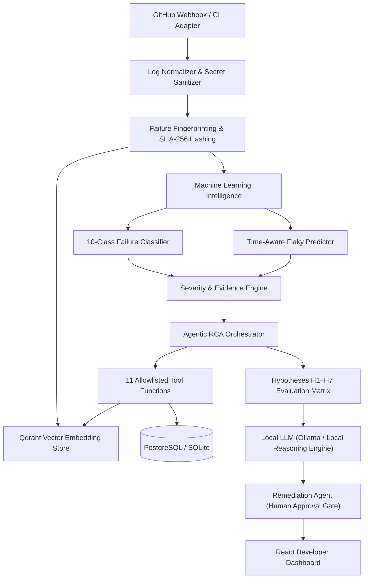

# AG004 — CI/CD Failure Intelligence & Flaky-Test Predictor Platform

[](https://github.com/)
[](https://fastapi.tiangolo.com)
[](https://react.dev)
[](https://qdrant.tech)
[](LICENSE)

An agentic, production-grade CI/CD failure intelligence platform that automates failure triage, regression isolation, and flaky-test prediction. Built to evaluate evidence strictly from real database records and vector stores with zero invented claims.

---

## Architecture Overview



---

## Key Features

1. **Independent 4-Score Separation (Rule §6):**
   - **Classification:** 10 categories (`REGRESSION`, `FLAKY_TEST`, `INFRASTRUCTURE`, `ENVIRONMENT`, `DEPENDENCY`, `NETWORK`, `TIMEOUT`, `BUILD_FAILURE`, `TEST_DATA`, `UNKNOWN`).
   - **Flakiness Score:** Independent probability (0.0 to 1.0) derived from status flips, execution time variance, and run history.
   - **Regression Probability:** Independent likelihood a recent code commit caused the failure.
   - **Severity Level:** Independent impact assessment (`NORMAL`, `LOW`, `MEDIUM`, `HIGH`, `CRITICAL`).
   - **RCA Confidence:** Strength of evidence (`LOW`, `MEDIUM`, `HIGH`).

2. **Strict Agent Tool Contract (Rule §4):**
   - 11 allowlisted tools querying real data: `get_test_history`, `get_failure_history`, `search_similar_failures`, `get_commit_diff`, `get_recent_commits`, `get_changed_files`, `get_component_owner`, `get_environment_history`, `get_deployment_history`, `calculate_flakiness`, `get_runtime_evidence`.
   - Immutable `EvidenceBundle` where every claim must cite verified `evidence_id`s (e.g. `EV-GIT_-05`).

3. **Cold-Start Benchmark Rule (Rule §8):**
   - Evaluates performance against ground truth benchmark data tagged `[synthetic benchmark]` until &ge; 200 real pipeline runs exist, at which point metrics transition automatically to `[real data]`. Zero fabricated metrics.

4. **Human Approval Gate (Rule §7 & §12):**
   - Remediations (`CODE_FIX`, `QUARANTINE_TEST`, `RETRY_PIPELINE`, `CONFIG_UPDATE`) enter `PENDING_APPROVAL` status and cannot trigger CI re-runs or destructive actions without explicit approval by `ADMIN` or `INVESTIGATOR` users.

5. **Security by Design:**
   - JWT authentication and Role-Based Access Control (`ADMIN`, `INVESTIGATOR`, `DEVELOPER`, `VIEWER`).
   - GitHub Webhook HMAC-SHA256 signature verification.
   - Log sanitization (automatically masks API keys, bearer tokens, passwords, memory addresses, UUIDs).
   - In-memory rate limiting and mutation audit logging in PostgreSQL.

---

## Directory Structure

```text
├── agents/                     # Agentic layer
│   ├── llm/                    # Local LLM client (Ollama/OpenAI compatible)
│   ├── orchestrator/           # Multi-agent orchestrator & evidence assembly
│   ├── rca_agent/              # Hypotheses H1-H7 evaluation matrix
│   ├── remediation_agent/      # Remediation actions & human approval gate
│   └── tools/                  # 11 Allowlisted tool functions
├── backend/                    # FastAPI backend
│   ├── app/
│   │   ├── api/                # REST endpoints (auth, pipelines, failures, ml, etc.)
│   │   ├── core/               # Security, config, database sessions
│   │   ├── middleware/         # Audit logger, rate limiter
│   │   ├── models/             # 18 SQLAlchemy database entities
│   │   ├── schemas/            # Pydantic request/response validation schemas
│   │   └── services/           # Ingestion, severity, evidence engines
│   └── requirements.txt
├── config/                     # Model configs, tool allowlists, component mapping
├── database/                   # PostgreSQL schema DDL, seed data, Qdrant client
├── datasets/                   # Synthetic benchmark datasets
├── demo_repo_scenarios/        # 7 executable live-demo scenarios
├── deployment/                 # Docker Compose and Kubernetes manifests
├── frontend/                   # React 18 + Vite + Tailwind CSS dashboard
├── ingestion/                  # GitHub Actions adapter, Jenkins stub, normalizer
├── ml/                         # Classification, flaky prediction, clustering, evaluation
└── tests/                      # Pytest unit and integration test suite
```

---

## Quickstart & Installation

### 1. Prerequisites
- Python 3.10+ (tested on Python 3.12)
- Node.js 18+ (tested on Node 20 & 24)
- Docker & Docker Compose (optional for containerized runtime)

### 2. Backend Setup
```bash
# Clone and enter directory
cd Hackwave2.0

# Create and activate virtual environment
python -m venv .venv
# On Windows:
.\.venv\Scripts\activate
# On Linux/macOS:
source .venv/bin/activate

# Install dependencies
pip install -r backend/requirements.txt

# Seed the 7 demo scenarios and vector store
python database/seed_data/seed_demo_scenarios.py

# Run FastAPI backend
uvicorn backend.app.main:app --host 0.0.0.0 --port 8000 --reload
```
API Documentation will be available at: [http://localhost:8000/docs](http://localhost:8000/docs)

### 3. Frontend Setup
```bash
cd frontend

# Install npm dependencies
npm install

# Run Vite dev server
npm run dev
```
Dashboard will be accessible at: [http://localhost:5173](http://localhost:5173)

**Administrator Bootstrap Credentials:**
- **Username:** `admin`
- **Initial Password:** On first boot in local development, a cryptographically secure random password is generated and printed once to server logs/stdout. In production environments, set `ADMIN_BOOTSTRAP_PASSWORD` via environment variable or `.env`.
- **Forced Password Rotation:** The administrator account requires an immediate password change upon first authentication before non-auth API endpoints can be accessed.
- **Role:** `ADMIN`

---

## Running the 7 Live-Demo Scenarios

Each scenario can be executed directly from the terminal or explored in the React Dashboard:

| # | Scenario | Command | Key Takeaway |
|---|---|---|---|
| 01 | Genuine Code Regression | `python demo_repo_scenarios/01_regression/run_scenario.py` | Identifies code break, maps component owner, proposes patch |
| 02 | Flaky Test | `python demo_repo_scenarios/02_flaky_test/run_scenario.py` | Detects 72% flip rate, flags low regression prob, recommends quarantine |
| 03 | Duplicate Failures | `python demo_repo_scenarios/03_duplicate_failures/run_scenario.py` | Groups failures sharing exact canonical fingerprint via Qdrant |
| 04 | Infrastructure Failure | `python demo_repo_scenarios/04_infrastructure_failure/run_scenario.py` | Isolates runner OOM kill without blaming code changes |
| 05 | External Dependency Outage | `python demo_repo_scenarios/05_dependency_network_failure/run_scenario.py` | Detects 503 Bad Gateway, recommends retry upon recovery |
| 06 | Build Toolchain Failure | `python demo_repo_scenarios/06_code_change_failure/run_scenario.py` | Catches compiler syntax/type break before test stage |
| 07 | Successful Rerun | `python demo_repo_scenarios/07_successful_rerun/run_scenario.py` | Verifies end-to-end resolution and passing CI build |

---

## Running Automated Tests

Run the full suite of unit and integration tests:

```bash
# Run all tests
python -m pytest tests/unit/ tests/integration/

# Test output:
# 12 passed in 18.14s
```

---

## Docker Compose Deployment

```bash
cd deployment/docker
docker compose up -d
```
Starts:
- PostgreSQL (5432)
- Qdrant Vector Database (6333)
- Ollama Local LLM (11434)
- FastAPI Backend (8000)
- React Frontend (5173)
- OpenTelemetry Collector (4318)
